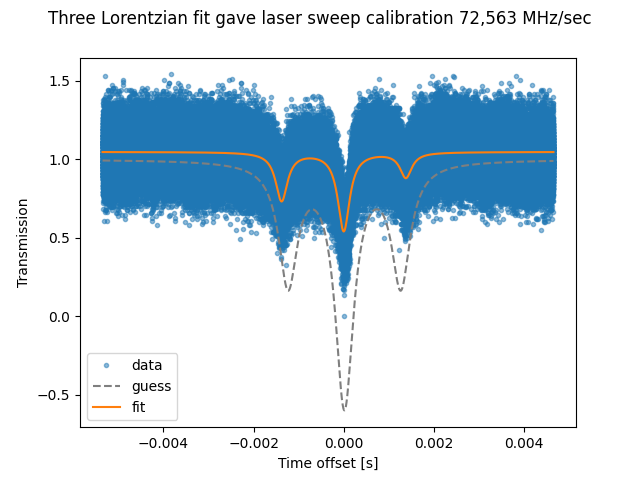
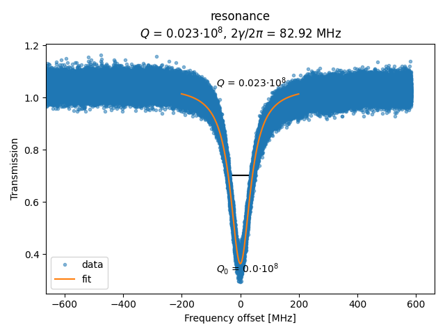

## Q-factor measurement tool and calculator

To install dependencies run `pip install keyoscacquire scipy pandas`

The module can easily be used for data captured not with keyoscacquire,
but `read_data()` must be changed accordingly. If you want to capture traces
the part of the programme that acquires traces must obviously also be changed.

The module can be used only to calculate the Q-factor with a known laser
frequency sweep per second calibration, or fit a trace with known sidebands to
also calculate this calibration.

The programme can acquire traces as necessary if the data has not already been
taken, run with option `-h` to learn about the syntax.

The module variable `_oscilloscope_visa_address` can be set to the VISA address
of the oscilloscope in use. (To find the VISA address run `list_visa_devices`
from the command line.) Or leave empty to use default VISA address in the
keyoscacquire packcage (which can be set by changing the file whose path is given
by running `path_of_config` from the command line).


Run `qfactor.py -h` to learn more about the syntax of use.

The example traces in `test_traces/` can be used to test the package, running
```bash
python qfactor.py -f "./test_traces/"  -v "vacuum" -c "sidebands_50MHz"  -r "resonance"
```
giving the calibration

the fitted Q-factor

